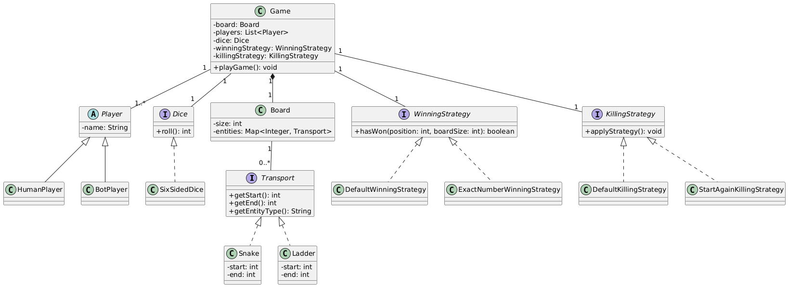

# Snake and Ladder Game

A well-architected implementation of the classic Snake and Ladder board game in Java, featuring design patterns and clean code principles.

## Features

- **Strategy Pattern**: Pluggable winning and killing strategies
- **Factory Pattern**: Clean creation of strategy instances
- **Builder Pattern**: Flexible game configuration
- **Clean Architecture**: Well-organized package structure

## Project Structure

```
src/main/java/com/game/
├── core/           # Core game logic (Game, Board, Dice)
├── entities/       # Game entities (Player, Transport, Snake, Ladder)
├── strategies/     # Strategy implementations
│   ├── winning/    # Winning condition strategies
│   └── killing/    # Player interaction strategies
└── factories/      # Factory classes for strategy creation
```

## UML Class Diagram

The following UML diagram illustrates the Low-Level Design (LLD) of the Snake and Ladder game, showing the relationships between classes and the implementation of design patterns:



## How to Run

1. Compile the project:
   ```bash
   javac -d target -cp . src/main/java/com/game/**/*.java
   ```

2. Run the game:
   ```bash
   java -cp target com.game.GameDemo
   ```

## Design Patterns Used

- **Strategy Pattern**: For different winning and killing strategies
- **Factory Pattern**: For creating strategy instances
- **Builder Pattern**: For flexible game configuration

## Game Rules

- Players take turns rolling a dice and moving on the board
- Landing on a ladder takes you up
- Landing on a snake takes you down
- First player to reach the end wins
- Optional killing strategies for player interactions